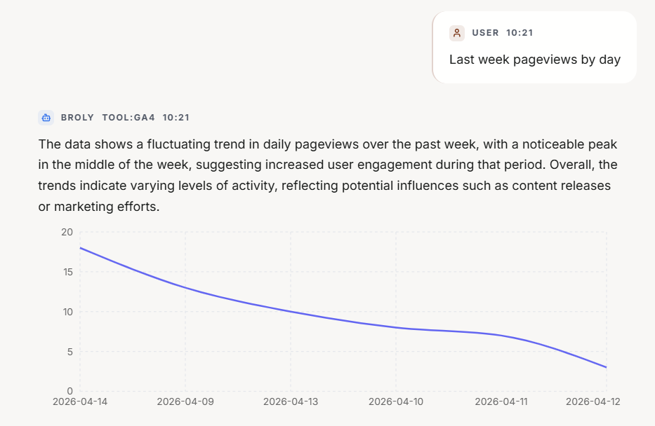

# Broly Analytics Agent

Broly Analytics Agent is a Next.js proof of concept for a chat-first analytics workspace. The app lets a user connect analytics data sources, choose the active assets they want to query, and ask natural-language questions from a single dashboard.

The app supports Google Analytics 4, BigQuery, and Snowflake as data sources. Each source is powered by an LLM analytics agent that inspects available metadata, runs queries against the data source, and turns the results into conversational answers with optional chart or table visuals.

## What The App Does

- Provides a dashboard with a chat composer, message history, and a collapsible data-source side panel.
- Stores chat sessions locally on disk so conversations survive page refreshes.
- Stores integration credentials locally with encrypted secret fields.
- Supports Google Analytics 4 OAuth connection, token refresh, property discovery, property selection, and Data API reporting.
- Supports BigQuery connection via Google OAuth, dataset selection, and SQL query execution.
- Supports Snowflake connection via Programmatic Access Token (PAT), database selection, and SQL query execution across all schemas.
- Supports LLM provider settings for Anthropic, OpenAI, Google, and Mistral.
- Routes natural-language questions to the correct data source agent based on the active integration.

## Tech Stack

- **Next.js App Router** — framework and routing
- **React / TypeScript** — UI and type safety
- **[Recharts](https://recharts.org)** — inline line charts inside chat bubbles
- **[Radix UI / react-accordion](https://www.radix-ui.com/primitives/docs/components/accordion)** — accordion in the data sources panel
- **[Lucide React](https://lucide.dev)** — icons
- **[google-auth-library](https://github.com/googleapis/google-auth-library-nodejs)** — GA4 OAuth token handling server-side
- **Custom CSS** — no component library (no Tailwind, no MUI, no shadcn); all UI is built with plain CSS using design tokens in `src/app/globals.css`
- **Local JSON/file-backed persistence** under `data/`
- **Google Analytics Admin API** for property discovery
- **Google Analytics Data API** for reports
- **Provider-specific LLM APIs** for natural-language planning and response generation (Anthropic, OpenAI, Google, Mistral)

## Project Structure

```text
src/app
  Dashboard, settings pages, and API routes

src/components
  Dashboard UI, data source panel, chat history, and settings components

src/context
  Client-side integration and chat session state

src/lib
  Persistence, encryption, orchestration, provider logic, and GA4 report execution

src/types
  Shared TypeScript types for integrations and LLM settings
```

## Local Development

1. Install dependencies.

   ```bash
   npm install
   ```

2. Start the app.

   ```bash
   npm run dev
   ```

3. Open the dashboard.

   ```text
   http://localhost:3000
   ```

## Configure The LLM Provider

GA4 chat uses an LLM provider to translate a natural-language question into a GA4 Data API report request and summarize the returned data.

1. Open `http://localhost:3000/settings/llm`.
2. Choose a provider: Anthropic, OpenAI, Google, or Mistral.
3. Choose a model from the model dropdown.
4. Paste the provider API key.
5. Click **Save**.
6. Click **Test Connection** to confirm the API key works.

The API key is stored locally under `data/llm-settings.enc.json` with encrypted secret fields.

## Connect Google Analytics 4

The recommended GA4 path is Google OAuth 2.0. This lets the user sign in with Google, grants Broly read-only Analytics access, and allows the app to list properties that the signed-in Google account can access.

### 1. Prepare Google Cloud

1. Open the Google Cloud Console.
2. Select or create a Google Cloud project for this local Broly app.
3. Enable these APIs:
   - Google Analytics Admin API
   - Google Analytics Data API
4. Open **APIs & Services > OAuth consent screen**.
5. Configure the consent screen for your app.
6. Add yourself as a test user if the app is in testing mode.

### 2. Create OAuth Credentials

1. Open **APIs & Services > Credentials**.
2. Click **Create Credentials > OAuth client ID**.
3. Choose **Web application**.
4. Add this authorized redirect URI for local development:

   ```text
   http://localhost:3000/api/connect/ga4/callback
   ```

5. If you deploy the app, add the deployed redirect URI too:

   ```text
   https://your-domain.example/api/connect/ga4/callback
   ```

6. Create the OAuth client.
7. Copy the **Client ID** and **Client Secret**.

### 3. Save The GA4 Credentials In Broly

1. Start Broly with `npm run dev`.
2. Open `http://localhost:3000/settings/integrations`.
3. Find **Google Analytics**.
4. Click **Set up**.
5. Keep **Credential type** set to **Google OAuth 2.0 (recommended)**.
6. Paste the Google OAuth **Client ID**.
7. Paste the Google OAuth **Client Secret**.
8. Click **Save connection**.

At this point Broly has the OAuth client details, but it does not yet have permission to access a Google account.

### 4. Connect With Google

1. On the Google Analytics integration card, click **Connect with Google**.
2. Choose the Google account that has access to your GA4 property.
3. Approve the requested read-only Google Analytics permission.
4. Google redirects back to:

   ```text
   /settings/integrations/google-analytics
   ```

5. Broly exchanges the OAuth code for access and refresh tokens, stores them encrypted, and marks the integration as configured.

The OAuth flow requests this scope:

```text
https://www.googleapis.com/auth/analytics.readonly
```

### 5. Select A GA4 Property

After Google connects successfully, the Google Analytics card shows a GA4 property selector.

1. Open the **GA4 Property** dropdown.
2. Choose the property you want the assistant to query.
3. Save the selected property if prompted.

Property IDs are stored in the `properties/123456789` format expected by the GA4 APIs.

The dashboard side panel also shows a compact GA4 property picker when Google Analytics is connected, so you can switch the active property without leaving the chat workspace.

### 6. Test The Connection

1. On the Google Analytics integration card, click **Test connection**.
2. A successful test means Broly can:
   - refresh or use the stored OAuth token,
   - read metadata for the selected GA4 property,
   - run a small GA4 Data API report.

If the test fails, check the troubleshooting section below.

### 7. Ask GA4 Questions

Return to the dashboard at `http://localhost:3000` and ask questions such as:

- `How many active users did we have in the last 7 days?`
- `Show sessions by country for the last 30 days.`
- `What were the top traffic sources last week?`
- `Compare purchase revenue this month to last month.`

The assistant fetches GA4 metadata for the selected property, asks the configured LLM to choose valid GA4 metrics and dimensions, runs the report, and summarizes the result in chat.

## Response Visuals

Broly automatically chooses how to display GA4 results based on the shape of the data returned. There are three possible outputs for every analytics question.

### Line Chart — temporal analysis

When you ask for a metric broken down **over time** (by day, by week, as a trend), Broly renders an interactive multi-line chart directly inside the chat bubble.



**Triggered when:** the GA4 query includes the `date` dimension — i.e. the user is asking about how something changes over time.

**How it works:**
- The LLM is instructed to include `date` in the dimensions whenever the question implies a time series.
- The GA4 rows are parsed into chart points on the server. The LLM writes a short 1–2 sentence trend insight only — it does not narrate the individual numbers.
- Single-metric queries produce one line. Multi-metric queries (e.g. "sessions and pageviews by day") produce one coloured line per metric with a legend.
- Rendered client-side via [Recharts](https://recharts.org) with a dynamic import (`ssr: false`).

**Example prompts:**
- `Sessions by day for the last 2 weeks`
- `Sessions and pageviews by day`
- `Show me the traffic trend this month`
- `Daily active users for the last 20 days`

**Current limit:** date-dimension queries are capped at **20 days** of data (`MAX_CHART_DAYS` in `src/lib/llm-planner.ts`) while the feature is being validated.

---

### Data Table — dimensional breakdown

When you ask for a metric broken down **by a non-time dimension** (by country, device, channel, page, source, etc.), Broly renders an inline data table inside the chat bubble.

**Triggered when:** the GA4 query includes at least one dimension that is not `date` — i.e. the user is asking how something differs across categories.

**How it works:**
- The LLM is instructed to include the relevant dimension (e.g. `country`, `deviceCategory`) when the question asks for a breakdown by category.
- Columns are ordered: dimensions first, metrics last.
- Dimension values are left-aligned; metric values are right-aligned and formatted with thousand separators (e.g. `1,234,567`).
- The LLM writes a short 1–2 sentence insight — it does not list the rows.
- Rows are capped at 20 (the same limit as the text summary path).

**Example prompts:**
- `Top 5 countries by sessions`
- `Sessions by device category last month`
- `Bounce rate by page`
- `Top channels by purchase revenue`

---

### Plain Text — scalar answers

When you ask for a single aggregate value or a conceptual question, Broly replies with a plain conversational message — no chart, no table.

**Triggered when:** the GA4 query has no dimensions (just raw metric totals), or the question is conceptual and does not require a data API call at all.

**Example prompts:**
- `Total sessions last month`
- `What is the bounce rate?`
- `How does GA4 calculate engagement rate?`
- `Total purchase revenue for the last 30 days`

## Connect Snowflake

Snowflake uses a Programmatic Access Token (PAT) — a static secret you generate in the Snowflake UI. There is no OAuth redirect. The token is pasted directly into the integration form.

### 1. Generate a PAT Token in Snowflake

1. Sign in to your Snowflake account.
2. Click your username in the top-right corner and open **My Profile**.
3. Scroll to **Programmatic Access Tokens** and click **Generate Token**.
4. Give the token a name (e.g. `broly-local`) and an expiry.
5. Copy the generated token — it is only shown once.

The role associated with the token must have the following privileges on the database you want to query:

```sql
GRANT USAGE ON DATABASE     <your_database>           TO ROLE <your_role>;
GRANT USAGE ON SCHEMA       <your_database>.<schema>  TO ROLE <your_role>;
GRANT SELECT ON ALL TABLES  IN SCHEMA <your_database>.<schema> TO ROLE <your_role>;
```

Without these grants, Broly can connect but will report that no tables exist.

### 2. Find Your Account Identifier

The account identifier is the hostname prefix used to reach your Snowflake account. Common formats:

| Format | Example |
|---|---|
| `orgname-accountname` | `myorg-myaccount` |
| `locator.region` | `xy12345.us-east-1` |
| `locator` | `xy12345` |

You can find it in **Admin > Accounts** in the Snowflake UI, or from the URL you use to log in:
`https://<account-identifier>.snowflakecomputing.com`.

### 3. Save The Snowflake Credentials In Broly

1. Start Broly with `npm run dev`.
2. Open `http://localhost:3000/settings/integrations`.
3. Find **Snowflake** and click **Set up**.
4. Enter your **Account Identifier** (e.g. `xy12345.us-east-1`).
5. Paste the **PAT Token**.
6. Click **Save connection**.

### 4. Test The Connection

Click **Test connection** on the Snowflake integration card. This runs `SELECT CURRENT_TIMESTAMP()` against your account to confirm the token and account identifier are valid.

### 5. Select A Database

1. Open the **Data Sources** side panel on the dashboard.
2. Click the **Snowflake** row to expand it.
3. Choose the database you want to query from the dropdown.

The selected database is saved automatically. You can switch databases here at any time without going back to the integration settings.

### 6. Optional — Select A Warehouse

If your account or role has no default warehouse configured, queries will fail unless you select one explicitly.

1. Go to `http://localhost:3000/settings/integrations`.
2. Open the **Snowflake** card.
3. Choose a warehouse from the **Warehouse** dropdown.
4. Click **Save selection**.

If your role already has a default warehouse, this step is optional — leave it set to **Account default**.

### 7. Ask Snowflake Questions

Return to the dashboard at `http://localhost:3000`, make sure Snowflake is the active source in the Data Sources panel, and ask questions such as:

- `What data is here?`
- `Give me 5 customer names.`
- `Show total orders by day for the last 30 days.`
- `Top 10 products by revenue.`
- `How many orders were placed this year?`

Broly automatically discovers the tables and columns in your selected database, sends that schema to the LLM, generates a Snowflake SQL query, executes it, and summarizes the result.

## Snowflake Troubleshooting

### Authentication failed — JWT subject claim empty

The integration was saved with `KEYPAIR_JWT` as the token type. Broly uses `PROGRAMMATIC_ACCESS_TOKEN`, which is required for PAT tokens. This error should not appear on a fresh setup; if it does, delete and re-create the integration.

### No tables found in database

The PAT token's role can see the database but has no USAGE on any schema or SELECT on any table. Run the grants listed in step 1 above, then ask again.

### `Object '...' does not exist or not authorized`

The table exists but the role cannot SELECT from it, or the object name is wrong. Verify grants in the Snowflake UI by running `SHOW TERSE TABLES IN DATABASE <db>` with the same role.

### `fetch failed` / `ENOTFOUND`

Broly cannot reach `<account-identifier>.snowflakecomputing.com`. Check that:

- the account identifier format is correct (see step 2),
- your network allows outbound HTTPS to `*.snowflakecomputing.com`,
- the Snowflake account is active and not suspended.

### Warehouse required error

Your role has no default warehouse. Select a warehouse in **Settings > Integrations > Snowflake** (see step 6).

### PAT token expired

Snowflake PAT tokens have a fixed expiry. Regenerate the token in **My Profile > Programmatic Access Tokens**, then update it in **Settings > Integrations > Snowflake > Edit**.

### No data returned for date-range questions

Your data may be from a historical time period. Broly will automatically detect this and retry the query using the actual date range in your data. If results still appear empty, ask `What is the earliest and latest date in <table>?` to confirm the data exists.

## GA4 Troubleshooting

### OAuth error: `not_configured`

The Google Analytics integration does not have a saved OAuth Client ID and Client Secret yet. Go back to **Settings > Integrations > Google Analytics**, click **Set up** or **Edit**, and save the OAuth credentials.

### OAuth error: `redirect_uri_mismatch`

The redirect URI in Google Cloud does not match the URL Broly is using. For local development, the authorized redirect URI must be exactly:

```text
http://localhost:3000/api/connect/ga4/callback
```

If you run on a different port or deploy to another domain, add that exact callback URL in the Google Cloud OAuth client settings.

### OAuth error: `access_denied`

The Google account rejected the consent prompt, or the account is not allowed by the OAuth consent screen test-user list. Add the account as a test user in Google Cloud or publish/configure the consent screen appropriately.

### No GA4 properties appear

Check that:

- the signed-in Google account has access to at least one GA4 property,
- the Google Analytics Admin API is enabled,
- the OAuth consent screen includes the account as a test user when in testing mode,
- the OAuth client was created in the same Google Cloud project where the APIs were enabled.

### Connection test fails after selecting a property

Check that:

- a property is selected,
- the selected property is a GA4 property, not a Universal Analytics property,
- the Google Analytics Data API is enabled,
- the Google account has permission to read the selected property,
- reconnecting Google Analytics refreshes the stored tokens if the saved connection is stale.

### Chat says no LLM provider is configured

Open `http://localhost:3000/settings/llm`, save an LLM provider, and test the connection. GA4 chat requires both a GA4 connection and an LLM provider.

## Data And Credential Storage

This is a local proof of concept. The app writes local state under the project `data/` directory:

- integration records and encrypted credentials,
- LLM settings and encrypted API key,
- chat sessions and chat index data.

Do not commit real `data/` files containing credentials or chat history.

## Current Limitations

- This is a POC, not a production-hardened deployment.
- Local file-backed persistence is not suitable for multi-user production use.
- Credentials are encrypted locally, but there is no external secret manager integration yet.
- GA4 reporting depends on the selected LLM choosing valid metrics and dimensions, although property metadata is provided to reduce invalid requests.
- Cross-source joins and reconciliation are not implemented.
- Power BI connector code exists but is hidden from the UI until that connection work resumes.

## Useful Commands

```bash
npm run dev
npm run build
npm run typecheck
```

`npm run typecheck` currently reports existing demo connection-status type errors in `src/lib/demo-data.ts` and `src/lib/store.ts`. Those are unrelated to the GA4 connection flow described above.

## Known Limitations

### BigQuery Connector — Sync Queries API

The BigQuery connector uses the **synchronous queries API** (`POST /projects/{id}/queries`) for simplicity. This has the following constraints:

- **~20s timeout** — queries that take longer will fail with a timeout error. The LLM is instructed to always include `LIMIT` clauses to keep result sets small, but complex aggregations over large date ranges may still time out.
- **Max 20 rows returned** — the connector caps results at 20 rows per query.
- **Not suitable for large datasets** — if you're querying months of high-traffic GA4 export data, some queries will be too slow for the sync API.

**When to migrate:** If users regularly hit timeouts, migrate to the **BigQuery Jobs API** (`POST /projects/{id}/jobs` with a `configuration.query` body). The Jobs API is asynchronous — it returns a `jobId` immediately, which you then poll until complete. This adds latency for fast queries but removes the timeout ceiling for slow ones.

The relevant file is `src/lib/agents/bigquery-agent.ts` — specifically the `executeBigQueryQuery` function.

### Snowflake Connector — Synchronous Query Timeout

The Snowflake connector uses the **Snowflake SQL API v2** in synchronous mode (`POST /api/v2/statements` with `"timeout": 60`). This has the following constraints:

- **60s timeout** — queries that take longer will fail. The LLM is instructed to always include `LIMIT` clauses, but complex aggregations over large tables may still exceed this.
- **Max 20 rows returned** — the connector caps results at 20 rows per query.
- **PAT token expiry** — PAT tokens have a fixed expiry date set at generation time. If a token expires, all queries fail until the token is regenerated and updated in the integration settings.
- **Schema metadata via `SHOW TERSE TABLES`** — Broly discovers tables using `SHOW TERSE TABLES IN DATABASE`, which only shows objects the PAT token's role has been explicitly granted access to.

**When to migrate:** If users regularly hit the 60s timeout, migrate to async polling using `GET /api/v2/statements/<handle>`. The relevant file is `src/lib/agents/snowflake-agent.ts` — specifically the `executeSnowflakeQuery` function.
